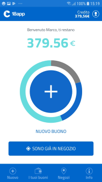

# 18app

> ⚠️ **WORK IN PROGRESS** ⚠️

Questo è il repository della app ufficiale per [18app](https://www.18app.italia.it/), sviluppata con il framework Xamarin.Forms per iOS e Android.

Lo sviluppo della app è ancora in corso e quindi non si trova negli app store. Segui la [pagina Facebook ufficiale](https://www.facebook.com/18app/) per ricevere aggiornamenti!

 

## Informazioni per sviluppatori

Il codice è contenuto in una singola soluzione Visual Studio all'interno della directory `src/`. Dopo aver clonato il progetto, puoi aprirlo con Visual Studio.

Consulta la [documentazione di Xamarin.Forms](https://docs.microsoft.com/en-us/xamarin/xamarin-forms/get-started/installation?tabs=windows#windows-system-requirements) per installare tutti gli strumenti di sviluppo necessari.

Potrai quindi compilare e testare la app localmente usando emulatori o dispositivi fisici.

## Come contribuire

I contributi sono benvenuti! Al momento siamo impegnati per il primo rilascio, quindi il codice cambia velocemente. Dopo il primo rilascio potremo valutare i contributi inviati sottoforma di Pull Request. Ti consigliamo di iniziare aprendo una issue in modo da discutere insieme il modo migliore per implementare la modifica, e di non includere troppe modifiche eterogenee nella stessa Pull Request.

## Autori

Questa app è stata sviluppata dal [Team per la Trasformazione Digitale](https://teamdigitale.governo.it/) in collaborazione con il [Ministero per i Beni e le Attività Culturali](http://www.beniculturali.it/) e [Sogei](http://www.sogei.it/).

* _Progetto UX/UI:_ [Matteo De Santi](https://teamdigitale.governo.it/it/people/34-profile.htm)
* _Sviluppo Xamarin:_ [Nicolò Carandini](https://www.linkedin.com/in/ncarandini/)
* _Coordinamento:_ [Alessandro Ranellucci](https://teamdigitale.governo.it/it/people/alessandro-ranellucci.html)

## Licenza

Il codice sorgente è rilasciato sotto licenza GPL-3.0.

