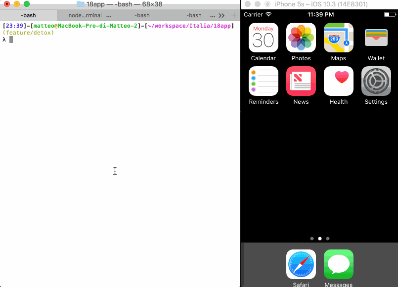

# 18 App
## Android and iOS mobile application for 18app service


This application in built in [React Native](https://github.com/facebook/react-native) and bootstrapped with [Create React Native App](https://github.com/react-community/create-react-native-app).

It's based on Expo app. It means that until the publish, you can develop it without any native requirement. You just need [Expo app](https://expo.io) and Node.js running on your machine.

At the end of development, it will compiled into a native package (.ipa and .apk) ready to be uploaded to Apple Store and Google Play.

* [Why React Native](#why-react-native)
* [Getting Started](#getting-started)
  * [Requirements](#requirements)
  * [First run](#first-run)
  * [Available scripts](#available-scripts)
* [Contributing](#contributing)
  * [Folder Structure](#folder-structure)
  * [Handle actions in Redux](#handle-actions-in-redux)
  * [Writing and Running Tests](#writing-and-running-tests)
* [Troubleshooting](#troubleshooting)

## Why React Native

Since its 2013 release, React has brought a new way to design UI components in the world wide web. The same fundamentals have been taken to another important environment in our contemporary world: the mobile applications. In the last two years React Native has become one of the most powerful multi-platform framework to develop mobile application. According to [Google Trend](https://trends.google.it/trends/explore?date=2015-01-01%202017-10-29&q=react%20native,iOS%20Development,Android%20Development), it seems to be the victorious horse.

We decided to use React Native due its popularity and its huge community around the world.<br />
And because [JavaScript is the most popular language](https://insights.stackoverflow.com/survey/2017#technology-programming-languages) and React.js one of [the most used framework](https://insights.stackoverflow.com/survey/2017#technology-frameworks-libraries-and-other-technologies).


## Getting Started
### Requirements
* Node.js
* XCode and/or iOS Simulator (optional)
* Android Studio and/or AVD (optional)

### First run
1. Clone the repo
1. `yarn install` or `npm install`
1. `npm run ios` or `npm run android` or `npm start`. See [available scripts](#available-scripts) below.

### Available Scripts
#### `npm start`

Runs your app in development mode.

Open it in the [Expo app](https://expo.io) on your phone to view it. It will reload if you save edits to your files, and you will see build errors and logs in the terminal.

Sometimes you may need to reset or clear the React Native packager's cache. To do so, you can pass the `--reset-cache` flag to the start script:

```
npm start -- --reset-cache
# or
yarn start -- --reset-cache
```

#### `npm test`

Runs the [jest](https://github.com/facebook/jest) test runner on your tests.

#### `npm run ios`

Like `npm start`, but also attempts to open your app in the iOS Simulator if you're on a Mac and have it installed.

#### `npm run android`

Like `npm start`, but also attempts to open your app on a connected Android device or emulator. Requires an installation of Android build tools (see [React Native docs](https://facebook.github.io/react-native/docs/getting-started.html) for detailed setup). We also recommend installing Genymotion as your Android emulator. Once you've finished setting up the native build environment, there are two options for making the right copy of `adb` available to Create React Native App:

##### Using Android Studio's `adb`

1. Make sure that you can run adb from your terminal.
2. Open Genymotion and navigate to `Settings -> ADB`. Select “Use custom Android SDK tools” and update with your [Android SDK directory](https://stackoverflow.com/questions/25176594/android-sdk-location).

##### Using Genymotion's `adb`

1. Find Genymotion’s copy of adb. On macOS for example, this is normally `/Applications/Genymotion.app/Contents/MacOS/tools/`.
2. Add the Genymotion tools directory to your path (instructions for [Mac](http://osxdaily.com/2014/08/14/add-new-path-to-path-command-line/), [Linux](http://www.computerhope.com/issues/ch001647.htm), and [Windows](https://www.howtogeek.com/118594/how-to-edit-your-system-path-for-easy-command-line-access/)).
3. Make sure that you can run adb from your terminal.


## Contributing
### Folder structure

```
18app/
  App.js
  app.json
  src/
    component/
    container/
    screen/
    res/
    stores/
    utils/
    Main.js
    MainNavigation.js
```

#### Screen

This directory contains the most external component of your single page. _E.g. Home, Coupons, Profile._

That component should structure your page, using [containers](#containers) components.

#### Container

This directory contains components which uses other [components](#components). It can be connected to Redux and keep inside business logic.

#### Component

This directory contains components _dummy_, with the minimal state needed and based on props. The most of them are not connected to Redux.

#### Utils

This directory contains utilities such as API, [reselect](https://github.com/reactjs/reselect) functions, and so on.

#### Stores

This directory contains the reducers of [Redux](https://github.com/reactjs/redux/).

We are using [Ducks approach](https://github.com/erikras/ducks-modular-redux), with reducers and action creators in same file.

### Handle actions in Redux

We uses [redux-promise-middleware](https://github.com/pburtchaell/redux-promise-middleware) and [redux-thunk](https://github.com/gaearon/redux-thunk) as handlers for async actions in Redux. Actions call the right middleware based on their payload.

If action dispatched is a function, `redux-thunk` will handle the action.

```js
// Action creator
export function thunkAction () {
  return dispatch => {
    myAsyncOperation(function callback() {
      dispatch({
        type: 'action',
        items: []
      })
    });
  }
}
```

If action returns an object with a promise in `payload` property, `redux-promise-middleware` will handle it.

```js
// Action creator
export function promiseAction () {
  return {
    type: 'action',
    payload: api('[...]/my-coupons')
      .then(({coupons}) => coupons)
  }
}
```

**CAUTION**: api endpoints should not be hardcoded inside action creators. They should be defined in `utils/api` and invoked by action creators.<br />
The example above is only to show how `redux-promise-middleware` works.

It will dispatch 3 events:
1. `action_PENDING` when the promise is run
1. `action_FULFILLED` when the promise is resolved
1. `action_REJECTED` when the promise is rejected

To create the actions for your reducer, there is `defineAsyncAction` utility function:

```js
// Actions
const LOAD = defineAsyncActions('LOAD')

LOAD // LOAD
LOAD.PENDING // LOAD_PENDING
LOAD.FULFILLED // LOAD_FULFILLED
LOAD.REJECTED // LOAD_REJECTED
```


### Writing and Running Tests

This project is set up to use [jest](https://facebook.github.io/jest/) for tests. You can configure whatever testing strategy you like, but jest works out of the box. Create test files in directories called `__tests__` or with the `.test` extension to have the files loaded by jest. See the [the template project](https://github.com/react-community/create-react-native-app/blob/master/react-native-scripts/template/App.test.js) for an example test. The [jest documentation](https://facebook.github.io/jest/docs/getting-started.html) is also a wonderful resource, as is the [React Native testing tutorial](https://facebook.github.io/jest/docs/tutorial-react-native.html).

#### e2e tests

This project uses [detox](https://github.com/wix/detox) as e2e test runner. You can write your spec inside the `e2e` directory and run them with `npm run e2e`.

E.g.:


## Troubleshooting

### Networking

If you're unable to load your app on your phone due to a network timeout or a refused connection, a good first step is to verify that your phone and computer are on the same network and that they can reach each other. Create React Native App needs access to ports 19000 and 19001 so ensure that your network and firewall settings allow access from your device to your computer on both of these ports.

Try opening a web browser on your phone and opening the URL that the packager script prints, replacing `exp://` with `http://`. So, for example, if underneath the QR code in your terminal you see:

```
exp://192.168.0.1:19000
```

Try opening Safari or Chrome on your phone and loading

```
http://192.168.0.1:19000
```

and

```
http://192.168.0.1:19001
```

If this works, but you're still unable to load your app by scanning the QR code, please open an issue on the [Create React Native App repository](https://github.com/react-community/create-react-native-app) with details about these steps and any other error messages you may have received.

If you're not able to load the `http` URL in your phone's web browser, try using the tethering/mobile hotspot feature on your phone (beware of data usage, though), connecting your computer to that WiFi network, and restarting the packager.

### iOS Simulator won't open

If you're on a Mac, there are a few errors that users sometimes see when attempting to `npm run ios`:

* "non-zero exit code: 107"
* "You may need to install Xcode" but it is already installed
* and others

There are a few steps you may want to take to troubleshoot these kinds of errors:

1. Make sure Xcode is installed and open it to accept the license agreement if it prompts you. You can install it from the Mac App Store.
2. Open Xcode's Preferences, the Locations tab, and make sure that the `Command Line Tools` menu option is set to something. Sometimes when the CLI tools are first installed by Homebrew this option is left blank, which can prevent Apple utilities from finding the simulator. Make sure to re-run `npm/yarn run ios` after doing so.
3. If that doesn't work, open the Simulator, and under the app menu select `Reset Contents and Settings...`. After that has finished, quit the Simulator, and re-run `npm/yarn run ios`.

### QR Code does not scan

If you're not able to scan the QR code, make sure your phone's camera is focusing correctly, and also make sure that the contrast on the two colors in your terminal is high enough. For example, WebStorm's default themes may [not have enough contrast](https://github.com/react-community/create-react-native-app/issues/49) for terminal QR codes to be scannable with the system barcode scanners that the Expo app uses.

If this causes problems for you, you may want to try changing your terminal's color theme to have more contrast, or running Create React Native App from a different terminal. You can also manually enter the URL printed by the packager script in the Expo app's search bar to load it manually.
